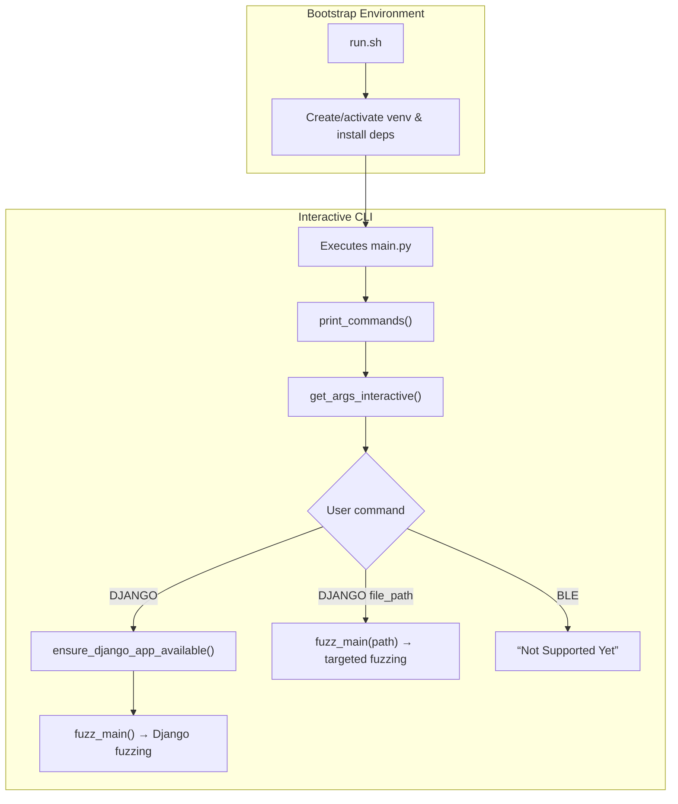

# Project Title: Software Testing 50.053

## Table of Contents
1. [Introduction](#introduction)  
2. [Purpose & Security Testing Approach](#purpose--security-testing-approach)  
3. [Architecture](#architecture)  
   1. [Overall Workflow](#overall-workflow)  
   2. [BLE Application Fuzzing](#ble-application-fuzzing)  
   3. [Django Application Fuzzing](#django-application-fuzzing)  
4. [Installation & Setup](#installation--setup)  
5. [Usage Examples](#usage-examples)  
6. [Visual Elements](#visual-elements)  
7. [Technical Challenges & Key Findings](#technical-challenges--key-findings)  
8. [Future Development](#future-development)  
9. [License](#license)  
10. [Contributing](#contributing)  

---

## 1. Introduction
- **Software Testing Project** using python
- Brief high-level overview of the two fuzz targets  

## 2. Purpose & Security Testing Approach
- Project goals (detecting crashes, undefined behavior, coverage improvements)  
- Why AFL fuzzing (advantages in genetic mutation, instrumentation)  
- Scope: BLE vs. Django targets  

## 3. Architecture
### 3.1 Overall Workflow
### 3.1 Overall Workflow


- **`run.sh`**  
  Acts as the project’s bootstrapper. When invoked, it:  
  1. Ensures you’re in the repository root.  
  2. Creates (if needed) and activates a Python 3 virtual environment in `.local`.  
  3. Installs or updates all dependencies from `requirements.txt`.  
  4. Hands control to `main.py` via `exec`, preserving the activated environment context.

- **`main.py`**  
  Serves as the interactive entrypoint to the AFL fuzzing harness. On launch it:  
  1. Loads environment variables from `.env` (e.g. Django folder names).  
  2. Configures colored CLI output and logging.  
  3. Displays supported targets and prompts for a command.  
  4. Validates the command, verifies any prerequisites (e.g. Django project structure), and then invokes the `simple_fuzzer2` harness (`fuzz_main()`) with or without a specific file argument.

### 3.2 BLE Application Fuzzing
- How AFL integrates with BLE binary  
- Instrumentation or harness details  
- Input formats and mutation strategy  

### 3.3 Django Application Fuzzing
- Web-app harness (HTTP endpoints, input sanitization)  
- AFL’s server-side instrumentation (e.g., compile flags)  
- Handling stateful targets (database snapshots, rollbacks)  

## 4. Installation & Setup
- **Prerequisites:** Python, AFL, BLE toolchain, Django dependencies  
- **Cloning & Environment:**  
  ```bash
  git clone …
  cd afl-power
  ./run.sh


Here’s a professional, visually-focused **README.md** outline in Markdown. You can later fill in each section with the detailed content.

```markdown
<!-- Badges: build status, code coverage, license, Python version, AFL fuzzing status -->
<!-- e.g. ](…)    -->

# Project Title: AFL-Power (Example)

## Table of Contents
1. [Introduction](#introduction)  
2. [Purpose & Security Testing Approach](#purpose--security-testing-approach)  
3. [Architecture](#architecture)  
   1. [Overall Workflow](#overall-workflow)  
   2. [BLE Application Fuzzing](#ble-application-fuzzing)  
   3. [Django Application Fuzzing](#django-application-fuzzing)  
4. [Installation & Setup](#installation--setup)  
5. [Usage Examples](#usage-examples)  
6. [Visual Elements](#visual-elements)  
7. [Technical Challenges & Key Findings](#technical-challenges--key-findings)  
8. [Future Development](#future-development)  
9. [License](#license)  
10. [Contributing](#contributing)  

---

## 1. Introduction
- **Project Title** and tagline  
- Brief high-level overview of the two fuzz targets  

## 2. Purpose & Security Testing Approach
- Project goals (detecting crashes, undefined behavior, coverage improvements)  
- Why AFL fuzzing (advantages in genetic mutation, instrumentation)  
- Scope: BLE vs. Django targets  

## 3. Architecture
### 3.1 Overall Workflow
- Diagram placeholder for end-to-end fuzzing pipeline  
- Description of `main.py` and `run.sh` roles  

### 3.2 BLE Application Fuzzing
- How AFL integrates with BLE binary  
- Instrumentation or harness details  
- Input formats and mutation strategy  

### 3.3 Django Application Fuzzing
- Web-app harness (HTTP endpoints, input sanitization)  
- AFL’s server-side instrumentation (e.g., compile flags)  
- Handling stateful targets (database snapshots, rollbacks)  

## 4. Installation & Setup
- **Prerequisites:** Python, AFL, BLE toolchain, Django dependencies  
- **Cloning & Environment:**  
  ```bash
  git clone …
  cd afl-power
  ./run.sh
  ```  
  
- **Configuration:** ENV vars, ports, file paths  

## 5. Usage Examples
- **Fuzz BLE Target:**  
  ```bash
  afl-fuzz -i inputs/ble -o findings/ble -- python3 main.py BLE
  ```  
- **Fuzz Django Target:**  
  ```bash
  afl-fuzz -i inputs/django -o findings/django -- python3 main.py DJANGO
  ```  
- Explanation of common flags and output interpretation  
