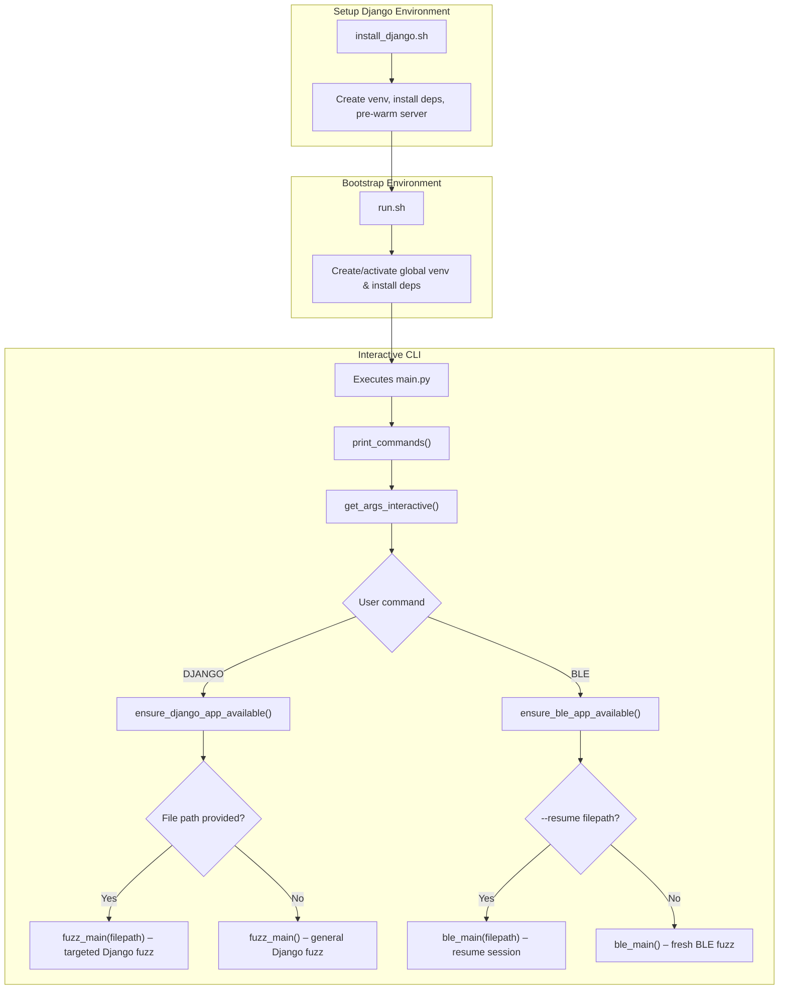

# Archived Repository 
**This repo has been archived and is now read-only** 

# Software Testing 50.053 – Software Testing Project

## Table of Contents
1. [Introduction](#1-introduction)  
2. [Purpose & Security-Testing Approach](#2-purpose--security-testing-approach)  
3. [Architecture](#3-architecture)  
   1. [Overall Workflow](#31-overall-workflow)  
   2. [BLE Application Fuzzing](#32-ble-application-fuzzing)  
   3. [Django Application Fuzzing](#33-django-application-fuzzing)  
4. [Installation & Setup](#4-installation--setup)  
5. [Usage Examples](#5-usage-examples)  

---

## 1  Introduction <a id="1-introduction"></a>

- Final Project for 50.053 Software Testing SUTD written in Python.  
- Two independent fuzz targets: **BLE smart-lock firmware** and a **Django web application**.
---

## 2  Purpose & Security-Testing Approach <a id="2-purpose--security-testing-approach"></a>

- **Goal:** detect crashes, undefined behaviour and maximise branch coverage.  
- **Engine:** *American Fuzzy Lop (AFL)* based for genetic mutations & lightweight instrumentation.  
---

## 3  Architecture <a id="3-architecture"></a>


- **`run.sh / run.bat`** – repository bootstrapper  
  1. **Change to the project root** – `cd "$(dirname "$0")"` guarantees the script always runs from its own folder.  
  2. **Create / activate a local virtual-env** – If the hidden folder `.local/` doesn’t exist, the script creates it (`python3 -m venv .local`) and then activates it.  
  3. **Install or update Python requirements** – If a `requirements.txt` file is present in the root, it upgrades `pip` and installs the pinned packages into the virtual-env.  
  4. **Delegate to `main.py`** – Finally it `exec`s `python main.py`, handing control (and the already-active environment) to your interactive fuzzer CLI.

- **`install_django.sh / install_django.bat` — Django target bootstrap**
  1. **Locates** `DjangoWebApplication/` and switches into it.  
  2. **Creates & activates** a dedicated virtual-env (`virtual/`) if missing.  
  3. **Installs/updates** all Python requirements.  
  4. **Pre-warms** the project by launching Django for a few seconds, compiling byte-code and loading migrations so subsequent starts are instant.  

After the script finishes, the virtual environment remains active and the Django server can be started immediately by the fuzzer or any other tool.


- **`main.py`** – interactive AFL front-end  
  1. Loads `.env` configuration.  
  2. Sets up colourised logging.  
  3. Prompts for a fuzzing command.  
  4. Validates arguments and dispatches to the correct harness.

## 4  Installation & Setup <a id="4-installation--setup"></a>

> **Prerequisites:** Python ≥ 3.10, AFL++, GNU make (Linux/macOS) or WSL (Windows), BLE tool-chain, Django 4.x.

```bash
# clone & bootstrap
git clone https://github.com/mrmrjing/SoftwareTestingProject
cd SoftwareTestingProject
```

## 5  Usage Examples <a id="5-usage-examples"></a>

### macOS / Linux

```bash
# one-time Django environment & pre-warm
./install_django.sh   

# launch interactive CLI
./run.sh
```

| Target | Fresh run | Resume / file-specific run |
|--------|-----------|----------------------------|
| **BLE**    | `BLE` | `BLE --resume <path-inside-BLE/>` |
| **Django** | `DJANGO` | `DJANGO <file-path>` |

### Windows (Command Prompt or PowerShell)

```bat

install_django.bat 
```
```bat
run.bat
```

| Target | Fresh run | Resume / file-specific run |
|--------|-----------|----------------------------|
| **BLE**    | `BLE` | `BLE --resume <path\inside\BLE\>` |
| **Django** | `DJANGO` | `DJANGO <file-path>` |

