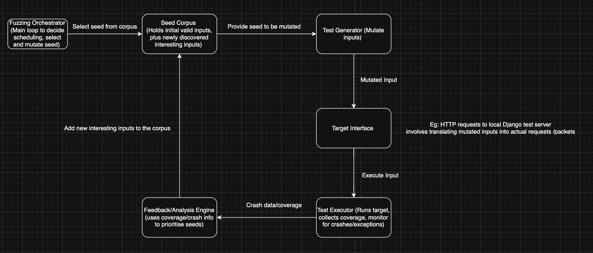

# Project Meeting 0 
- Discuss the overall design of fuzzer (slides/hand-drawn/word)
    * Send mutated HTTP requests to a local Django test server and track coverage 
    * Send random BLE packets to the hardware lock and detect crashes or hangs

- Highlight which parts of the fuzzer we plan to implement ourselves 
    * Main Loop: Decide which seed to pick from the corpus, how many mutations to apply, scheduling of fuzz iterations
    * Seed Corpus: Queue/priority queue 
    * Mutation Engine: Domain specific manipulations for HTTP data and BLE packets 
    * Target Interface: 
        * Django --> Python module that issues HTTP requests to local test Django server with coverage running 
        * Hardware lock --> Module that sends BLE packets to the BLE lock 
    * Feedback Engine: Implement custom heuristics to evaluate whether a new input is intersting (covers new path or triggers a unique crash)
- Discuss set of tools we plan to use out-of-the-box 
- Discuss which parts of the designs are generic, and which parts need to be configured/tuned based on the two case studies 
- Discuss the use cases for the fuzzer, i.e. how would someone use our fuzzer beyond the case studies 

1. What are the test inputs? 
For Django web app: 
    - HTTP/HTTPs requests containing form data, query parameters, create a seed_http.txt file (fill_table.py)
        * Modify input size to detect crashes 
For BLE application: 
    - Valid BLE packets including header fields and payload (smartlock.py)

2. Which file(s) do you use to start writing your fuzzer/ which file(s) show a demo test case? 
    - Create a test driver file called fuzzer.py 
    - fill_table.py 
    - smartlock.py

3. How do you get code coverage for Django application? 
    - Instrument the Django server so that every route or function call is measured when a request is processed(?)
    - From the docs: coverage.py
    https://docs.djangoproject.com/en/5.0/topics/testing/advanced/#integration-with-coverage-py

3.1. How do you get code coverage for smartlock application? 
    - Serial port 
    - response 

4. How do you detect crashes and logical bugs? 
    - Crashes: Exit codes, 
    d exceptions, or logs that show internal server errors, or server shutting down unexpectedly 
    - Logical bugs: incorrect responses, unexpected states
    - Restarts

5. What feedbacks to collect from test execution to improve fuzzer/which tests are interesting? 
    - Coverage 
    - For smart lock, we have to come up with ourselves 

6. How to improve the fuzzer to find more bugs efficiently? 

## Fuzzer Architecture 

